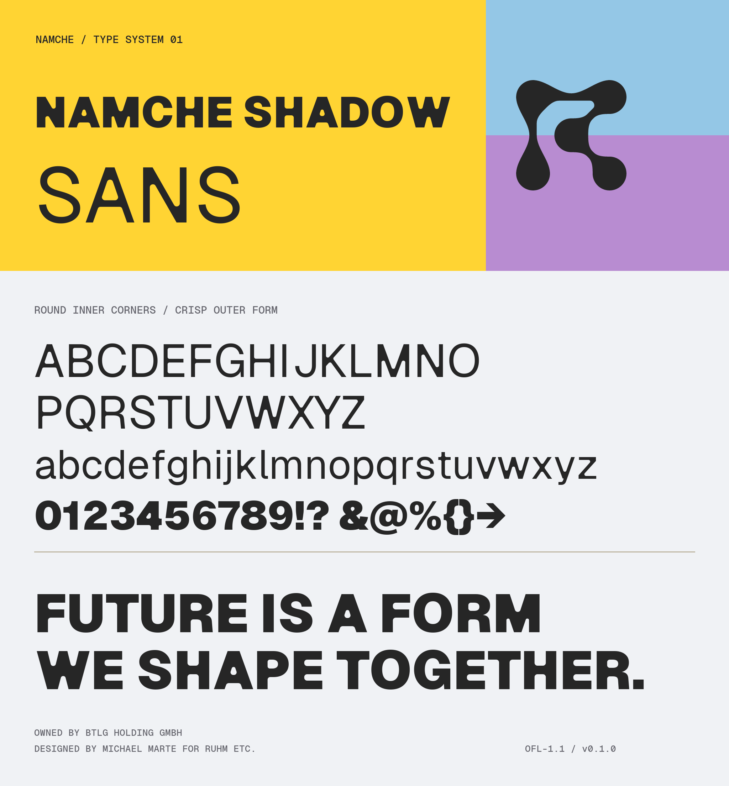

# Namche Shadow

<picture>
  <source media="(prefers-color-scheme: dark)" srcset=".docs/img/namche-shadow-banner--dark.png">
  <source media="(prefers-color-scheme: light)" srcset=".docs/img/namche-shadow-banner--light.png">
  
</picture>

Namche Shadow is a three-family type suite based on
[Vercel's Geist](https://github.com/vercel/geist-font):

| Family | Source | Status |
| --- | --- | --- |
| **Namche Shadow Sans** | Geist Sans | Custom inner-corner treatment designed by Michael Marte |
| **Namche Shadow Mono** | Geist Mono | Identical outlines and metrics; renamed for future Namche-specific work |
| **Namche Shadow Pixel** | Geist Pixel | Identical outlines and metrics; renamed for future Namche-specific work |

The repository follows the upstream Geist font-project layout: buildable
sources are in `sources/`, generated releases are in `fonts/`, automation is
in `.github/workflows/`, and the Next.js package is in `packages/next/`.

## Building

Fonts are built and tested by GitHub Actions. To run the same workflow
locally:

```sh
make build
make test
make proof
```

The Namche Shadow Sans RoundCorner workflow still requires Glyphs for final design
exports. See [`scripts/NAMCHE_SHADOW.md`](scripts/NAMCHE_SHADOW.md) and
[`LEARNINGS.md`](LEARNINGS.md) before producing a release.

## Repository layout

| Path | Purpose |
| --- | --- |
| `sources/` | Namche-named Glyphs sources and gftools builder configs |
| `fonts/` | OTF, TTF, variable, and WOFF2 distributions |
| `originals/geist/` | Immutable safecopy of the original Geist sources |
| `scripts/` | Upstream build helpers and Namche Shadow Sans design tooling |
| `packages/next/` | Next.js package, adapted from the upstream package |
| `documentation/` | Specimens, proofs, and project history |

The original archive must not be edited. Its provenance is documented in
[`originals/geist/UPSTREAM.md`](originals/geist/UPSTREAM.md).

The npm release workflow is prepared for token-free OIDC publishing. Its
one-time registry bootstrap is documented in
[`documentation/TRUSTED_PUBLISHING.md`](documentation/TRUSTED_PUBLISHING.md).

### Variable fonts

Namche Shadow Sans, Mono, and Pixel all build as variable fonts. The Sans
variable fonts are generated directly from Michael's rounded upright and
italic masters. The dedicated `@namche/namche-shadow/font/sans` npm export
serves both files.
Static upright and italic Sans weights remain available through the default
package export and `@namche/namche-shadow/font/sans-non-variable`.

## Credits

The Namche Shadow Sans design direction and implementation is done by
[Michael Marte](https://github.com/fizzybubbele) for
[Ruhm etc.](https://ruhmetc.com/).

The suite is derived from Geist, created by Vercel in collaboration with
Basement Studio, Andrés Briganti, Mateo Zaragoza, and the other contributors
listed in [`AUTHORS.txt`](AUTHORS.txt) and [`CONTRIBUTORS.txt`](CONTRIBUTORS.txt).
Namche Shadow Mono and Namche Shadow Pixel currently preserve their upstream
outlines exactly; their new names do not imply an original redesign.

## License

The fonts, sources, and derivative font work are licensed under the
[SIL Open Font License 1.1](OFL.txt). Original Geist copyright notices and
author credits are retained in the sources and binary font metadata.
